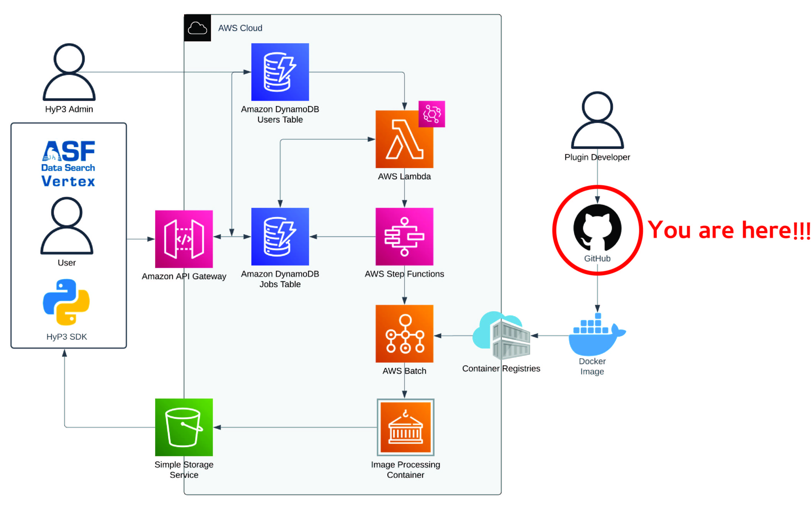

# HyP3-ISCE2 Plugin

The HyP3-ISCE2 plugin provides a set of workflows to process SAR satellite data using the [InSAR Scientific Computing Environment 2](https://github.com/isce-framework/isce2) (ISCE2) software package. This plugin is part of the [Alaska Satellite Facility's](https://asf.alaska.edu) larger HyP3 (Hybrid Plugin Processing Pipeline) system, which is a batch processing pipeline designed for on-demand processing of SAR data.

## Background
HyP3 is broken into two components: the cloud architecture/API that manage processing of HyP3 workflows, and Docker container plugins that contain scientific workflows which produce new science products from a variety of data sources (see figure below for the full HyP3 architecture).



The cloud infratstructure-as-code for HyP3 can be found in the main [HyP3 repository](https://github.com/asfhyp3/hyp3). This repository contains a plugin that can be used to process ISCE2-based processing of SAR data.

This project was heavily influenced by the [DockerizedTopsApp](https://github.com/ACCESS-Cloud-Based-InSAR/DockerizedTopsApp) project, which contains a similar workflow that is designed to produce ARIA Sentinel-1 Geocoded Unwrapped Interferogram standard products via HyP3.

## Developer Setup
1. Ensure that conda is installed on your system (we reccomend using [mambaforge](https://github.com/conda-forge/miniforge#mambaforge) to reduce setup times).
2. Download a local version of the HyP3-ISCE2 repository (`git clone https://github.com/ASFHyP3/hyp3-isce2.git`)
3. In the base directory for this project call `mamba env create -f environment.yml` to create your Python environment, then activate it (`mamba activate hyp3-isce2`)
4. Finally, install a development version of the package (`python -m pip install -e .`)

To run all commands in sequence use:
```bash
git clone https://github.com/ASFHyP3/hyp3-isce2.git
cd hyp3-isce2
mamba env create -f environment.yml
mamba activate hyp3-isce2
python -m pip install -e .
```

## Usage
The HyP3-ISCE2 plugin provides a set of workflows (accessable directly in Python or via a CLI) that can be used to process SAR data using ISCE2. The workflows currently included in this plugin are:

---
- `**insar_tops_burst**`: A workflow for creating single-burst Sentinel-1 geocoded unwrapped interferogram using ISCE2's TOPS processing workflow 
---

To use one of these tools, simply run `python -m hyp3_isce2 ++process [WORKFLOW_NAME] [WORKFLOW_ARGS]`. For example, to run the `insar_tops_burst` workflow:

```
python -m hyp3_isce2 ++process insar_tops_burst \
  --reference-scene S1A_IW_SLC__1SDV_20200604T022251_20200604T022318_032861_03CE65_7C85 \
  --secondary-scene S1A_IW_SLC__1SDV_20200616T022252_20200616T022319_033036_03D3A3_5D11 \
  --swath-number 2 \
  --polarization VV \
  --reference-burst-number 7 \
  --secondary-burst-number 7 \
  --azimuth-looks 4 \
  --range-looks 20
```

This command will create a Sentinel-1 interferogram that contains a deformation signal related to a 2020 Iranian earthquake.
To learn about the arguments for each workflow, look at the help documentation (`python -m hyp3_isce2 ++process [WORKFLOW_NAME] --help`).
Each workflow can also be accessed via an alternative CLI with the format (`[WORKFLOW_NAME] [WORKFLOW_ARGS]`)

The ultimate goal of this project is to create a docker container that can run ISCE2 workflows within a HyP3 deployment. To run the current version of the project's container, use this command:
```
docker run -it --rm ghcr.io/ASFHyP3/hyp3-isce2:latest python -m ++process [WORKFLOW_NAME] [WORKFLOW_ARGS]
```
## License
The HyP3-ISCE2 plugin is licensed under the Apache License, Version 2 license. See the LICENSE file for more details.

## Code of conduct
We strive to create a welcoming and inclusive community for all contributors to HyP3-ISCE2. As such, all contributors to this project are expected to adhere to our code of conduct.

Please see `CODE_OF_CONDUCT.md` for the full code of conduct text.

## Contributing
Contributions to the HyP3-ISCE2 plugin are welcome! If you would like to contribute, please submit a pull request on the GitHub repository.

## Contact Us
Want to talk about HyP3-ISCE2? We would love to hear from you!

Found a bug? Want to request a feature?
[open an issue](https://github.com/ASFHyP3/asf_tools/issues/new)

General questions? Suggestions? Or just want to talk to the team?
[chat with us on gitter](https://gitter.im/ASFHyP3/community)
